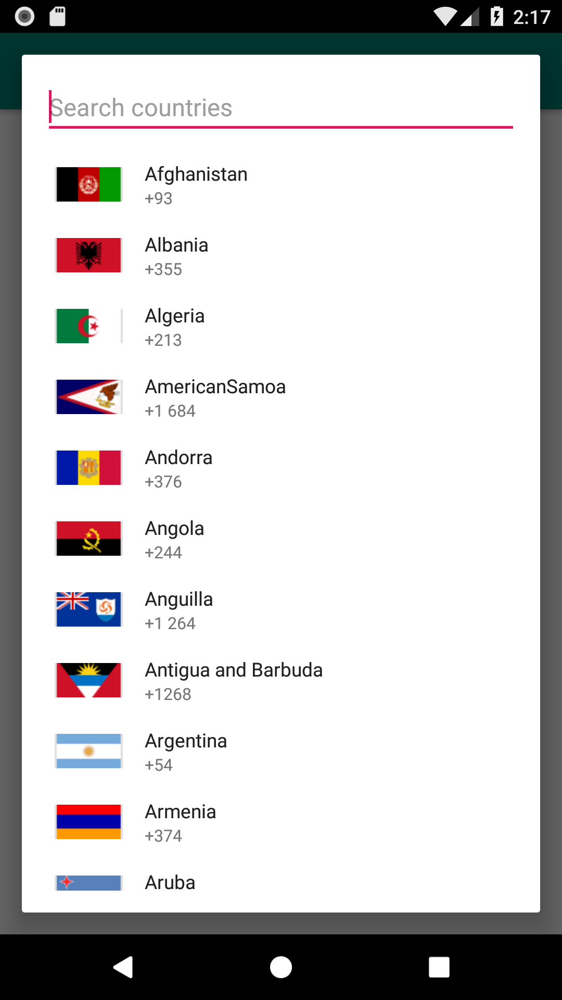

# Country code picker dialog 



Simple country code picker dialog for Android with RTL support.

## Usage

```kotlin
CountryCodePickerDialogFragment.getInstance().show(supportFragmentManager, "")
```

Let your activity or fragment implement `OnCountryCodeSelectedListener` in order to receive a callback when an user selected a country. The `CountryCode` object that is returned includes:

- `name` (The name of the country, i.e: United States)
- `code` (The code of the country, i.e: US)
- `dialCode` (The dial code of the country, i.e: +1)

## Extras

- `CountryCodePickerDialogFragment.getInstance()` can take a `defaultSelectedCountryCode` property to default select a country in the list
- Example how to get a United States `CountryCode` object without interacting with the dialog:

```kotlin
val countryCodesFetcher = CountryCodesFetcher(CountryCodesJsonFromDiskFetcher(requireContext()))
val myCountryCode = countryCodesFetcher
    .getCountryCodes()
    .first { it.code == "US")
```

## Download

Add jitpack to your projects `build.gradle`

```
allprojects {
  repositories {
    ...
    maven { url 'https://jitpack.io' }
  }
}
```

Add the library dependency to your app's `build.gradle'

```
dependencies {
    implementation 'com.github.BartNijland91:android-countrycodepickerdialog:v1.1'
}
```

## License

See [LICENSE](https://github.com/BartNijland91/android-countrycodepickerdialog/blob/master/LICENSE.MD) for details.
